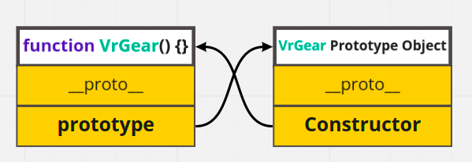

# 19장 프로토타입

- 객체를 담는 서버(클라우드)
---
## 19.2 상속과 프로토타입

- 자바스크립트는 프로토타입을 기반을 상속을 구현 (공유)
### `__proto__`
- __proto__라는 네임태그를 통해 프로토타입을 향해 접근 가능 (즉, 카피를 가져올 수 있는 키)
- __proto__를 통해서만 접근하는 것은 순환 참조 에러를 체크하기 위해 만들어짐 (들어가기 전에 자물쇠 같이)
- 코드 내에서는 사용하지 말고 `Object.setPrototypeOf` 매서드를 사용하시오

### `constructor`
- 프로토타입안의 또다른 네임태그 박스
- 위 이미지에서 Prototype Object는 원형의 카피이며 카피안에 있는 생성자가 원형을 가르킴 (프로토타입은 복사본을 가르킴)

## 19.4 리터럴 표기법에 의해 생성된 객체의 생성자 함수와 프로토타입

- 리터럴로 생성한 객체에도 상속을 적용해야 하므로 엔진이 가상의 생성자 함수를 주게됨
- 뭔가 함수를 대충 생성해서 주는거 같은데 나름 Function생성자 함수처럼 동작되는 함수임
- Object, Funtion, Array, RegExp를 생성해줌

## 19.5 프로토타입의 생성시점
- 함수에 이름이 붙을때 프로토 타입도 같이 생긴다
- 프로토 타입도 객체이므로 프로토 타입도 프로토 타입이 있다. 그것은 바로 `Object.prototype`.

## 19.6 객체 생성 방식과 프로토타입의 결정
- 객체 리터럴은 OrdinaryObjecyCreate가 프로토타입을 만들고 Object생성자 함수로 생성된 객체는 인수없이 호출하므로 빈객체가 생성됨(객체 리터럴처럼)
- 결국 똑같이 OrdinaryObjecyCreate가 Object.prototype을 불러오게 되므로 동일한 구조가 됨
- 하지만 new연산자를 통해 생성자 함수로 만들면 Constructor 딸랑 하나만 만들어짐 (완전 커스텀)
- 즉 프로토 타입에 프로퍼티를 각인할 수 있다 마치 클라우드 처럼

## 19.7 프로토 타입 체인
- 객체의 프로퍼티를 찾는데 해당 객체에 없으면 상위 프로토 타입 체인으로 올라감
- 현재 카피 검색 -> 원본 프로토타입 검색 -> 원본 프로토타입안의 Object.prototype 검색 순

## 19.8 오버라이딩과 프로퍼티 섀도잉
- 오버라이딩 : 카피에 원본과 동일한 메서드르 추가하면 프로토타입에 반영하는게 아니고 카피에 덮어씌움
- 프로퍼티 섀도잉 : 그러다보니 해당 메서드를 카피에서 호출할때 카피의 매서드로 부르게됨 그러면 프로토타입 이름은 가려지게되는 현상
- 해당 메서드를 변경할때 카피에 있는걸 변경 하더라도 오버라이딩 된거만 바뀜. 해당 매서드를 통해 원본으로 간접 접근은 불가

## 19.9 프로토타입의 교체
- 프로토 타입을 교체할때는 constructor 와의 연결고리를 꼭 지켜줘야함
- 만일 존재하지 않는다면 constructor 프로퍼티 추가를 별도로 해주어야함

## 19.11 직접 상속
- Object.create로 프로토타입에 직접 객체를 추가할수있다.
- 장점은 new 안써도 되고, 프로토타입 지정하면서 생성할수있고, 객체 리터럴로도 추가 가능
- 단, 프로토 타입 제일 바닥에서는 사용할수 없음. 기본이 되는 객체에 또 객체를 생성하게 되므로

## 19.12 정적 프로퍼티/메서드
- 원본에서 굳이 카피 안하고 생성자 붙여서 가져다 불러올수 있는 프로퍼티 혹은 메서드를 칭함

***

# 끝