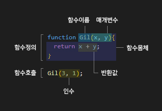

# **12.1 함수란?**
함수는 여러가지 과정을 하나로 이어지는(일련의 과정) 문으로 구현하고 코드블럭으로 감싸서 하나의 실행단위로 정의하는것이다.

<p align="center">
    
</p>

* 함수 내부로 입력을 전달받는 변수를 **매개변수**라고한다.
* 매개변수에 입력받는 값을 **인수**라고 한다.
* 함수는 **함수정의**를 통해서 생성된다. (이때 실행되지는 않는다.)
* 인수를 매개변수에 입력해서 값을 전달해 함수를 실행시키는 것을 **함수호출**이라고 한다.
* 함수를 실행 후 값을 출력되는 값을 **반환값**이라고 한다.

<br>

# **12.2 함수를 사용하는 이유**

1. 재사용 할 수 있어 반복되는 실행을 할 때 효율적이다. (이때 같은 함수를 사용하므로 신뢰성이 높고, 유지보수 편의성이 좋다.)
2. 함수명을 지을때 역할을 설명할 수 있어서 가독성이 좋다.

```js
function onLoadEvent(){ // 함수명을 보고 어떤 함수일지 예측해보자!
    window.addEventlistener('load',function(){
        console.log('Onload!! wow~');
    });
}
```

<br>

# **12.3 함수 리터럴**

```js
//변수에 함수리터럴 할당
const Gil = function sayHello(x,y){
    return x + y;
}
```

> ### **함수이름**
>>* 식별자 네이밍 규칙을 준수해야한다.
>>* 함수 몸체 내에서만 참조할 수 있는 식별자다.
>>* 이름을 가진 함수를 기명함수, 없는 함수를 무명·익명 함수라고 한다.

<br>

> ### **매개변수 목록**
>>* 0개 이상의 매개변수를 소괄호로 감싸고 쉼표로 구분한다.
>>* 입력한 순서에 맞게 인수가 할당된다.
>>* 식별자 네이밍 규칙을 준수해야 한다.

<br>

> ### **함수몸체**
>>* 함수호출로 실행된다.
>>* 함수호출시 한번에 실행될 문을 하나의 실행단위로 정의한 코드블록이다.

<br>

# **12.4 함수 정의**
함수정의는 쉽게 말하면 함수를 만드는것이다. 이때 함수명, 매개변수지정, 실행문 작성, 반환값 지정을 한다.

> ## **함수정의 방법 4가지**
>> ```js
>> //함수선언문
>> function Gil(x,y){
>>     return x + y;
>> }
>>
>> //함수표현식
>> const Gil = function(x,y){
>>    return x + y;
>> }
>>
>> //Function 생성자 함수
>> const Gil = new Function('x','y','return x + y');
>> 
>> //화살표함수 ES6문법
>> const Gil = (x,y) => x + y;
>> ```

<br>

## **12.4.1 함수 선언문**
함수선언문은 표현식이아닌 문 이기때문에 변수에 할당할수가 없다. <br>그리고 함수명(함수식별자)은 함수 내에서만 유효하기때문에 함수호출이 되지않는것이 정상이지만 자바스크립트 엔진에서 **함수명과 동일한 식별자를 암묵적으로 생성**하기때문에 호출이 가능한것이다.

```js
//함수선언문이 변수에 할당된것 처럼 보인다.
//하지만 아래는 함수선언문이아닌 함수표현식이다.
//(함수표현식은 함수명을 생략을 안 할 수도 있다.)
const hey = function Gil(x, y){
    return x + y;
}

console.log(`${hey}`); //함수가 나옴, 식별자를 이용해 호출
console.log(`${Gil}`); //Uncaught ReferenceError
```

<br>

## **12.4.2 함수 표현식**
함수는 일급객체이므로 값처럼 사용할 수 있고, 그중 표현식은 보통 익명함수로 사용하며 마찬가지 함수명으로 호출할 때 에러가 발생한다.
> 함수선언문은 **표현식이 아닌 문**이고 함수표현식은 이름 그대로 **표현식인 문**이라는 차이점이 있다.

<br>

## **12.4.3 함수 생성 시점과 함수 호이스팅**

> 함수선언문은 함수선언문 이전에 호출, 참조가 가능하다. 이러한 특성을 **함수 호이스팅** 이라고한다. <br><br> 함수선언문은 런타임 이전인 소스코드평가를 할때 암묵적으로 식별자를 생성하고 거기에 함수객체를 할당해둔다.
```js
console.dir(Gil); // f Gil(x,y)
console.log(Gil(1,2)); // 3
//소스코드평가때 식별자를 생성, 객체 할당을 하여 선언문 이전에 참조,호출가능

function Gil(x,y){
    return x + y;
}
```
<br>

> 함수표현식은 런타임때 호출,실행 되는 시점에 변수에 함수객체를 할당한다. 따라서 표현식이전에 호출이 되지않는다.
```js
console.dir(Gil); // undefined (할당된 상태지만 에러가 뜸)
console.log(Gil(1,2)); // TypeError
//소스코드평가를 할 때는 할당한 변수를 선언 하고 undefined를 할당한 상태이다.

const Gil = function (x,y){
    return x + y;
}

console.log(Gil(1,2)); // 3
```
📌 json 만든 아저씨는 표현식 사용을 권장한다고 한다.

<br>

## **12.4.4 Function 생성자 함수**
생성자함수는 함수객체를 생성하여 변수에 반환한다.

<br>

## ~~**12.4.5 화살표 함수**~~

<br>

# **12.5 함수 호출**
함수를 호출하면 실행흐름을 중단하고 호출된 시점으로 실행흐름을 옮긴 후 매개변수에 인수가 할당되어 몸체 문들이 실행을 시작한다.

<br>

## **12.5.1 매개변수와 인수**
함수를 실행할때 필요한값을 매개변수와 인수값으로 할당하여 내부로 가져올때 사용된다.

```js
function Gil(x,y){
    console.log(`${arguments[2]}`); //Gil(1,2,3) 에서만 3호출
    return x + y;
}

console.log(Gil(1)); //NaN
console.log(Gil(1,2)); //3
console.log(Gil(1,2,3)); //3
console.log(x); //Uncaught ReferenceError
```

* 매개변수는 변수와 마찬가지로 초기화(undefined 할당)가 된다.
* 매개변수의 스코프 범위는 함수 내부까지다.
* 인수의 개수가 매개변수 개수보다 적거나 초과하더라도 에러도 뜨지않고, arguments 객체(array) 상태로 보관이 된다.(함수내부에서 호출 가능)

<br>

## ~~**12.5.2 인수확인**~~

<br>

## **12.5.3 매개변수의 최대 개수**
함수에서 매개변수는 적을 수록 좋으며 3개 이상의 매개변수가 필요 하다면 인수값을 객체로 전달 하는것이 좋다.

```js
function Gil(x){
    console.log(x.a + x.b); // 3
}
Gil({a:1,b:2,c:3,d:4,e:5});
```

<br>

## **12.5.4 반환문**

* 함수는 return과 표현식(반환값)으로 외부로 실행결과를 외부로 반환가능하다.
* 함수실행을 중단하고 몸체를 빠져나간다.
* return 키워드 뒤 표현식을 평가해 반환한다.
* return 키워드를 쓴뒤 표현식을 줄바꿈하면 세미콜론 자동삽입에 의해 값의 반환이 무시된다. 줄바꿈이 필요하면 'return ()'를(괄호) 사용하자!

```js
function Gil(){
    var BBB = {
        a:1,
        b:2
    }
    return ( //줄바꿈 필요시 괄호 사용
        BBB.a + BBB.b
    )
    //실행되지않음
    console.log('hi!');
}
var AA = Gil();

console.log(AA);
```

<br>

# **12.6 참조에 의한 전달과 외부 상태의 변경**
함수의 매개변수에 할당되는 인수로 원시값을 할당하면 외부에는 영향이 미치지 않으며, 객체타입을 할당할 경우 외부에 영향을 미칠수 있다.

```js
function Gil(x,y){
    x += 10;
    y.name  = 'gil';
}

const Val1 = 1;
const Val2 = {name:'hi'};

Gil(Val1, Val2);

console.log(Val1); // 1
console.log(Val2); // {name:'gil'}
```
> 객체타입의 값을 인수에 할당 했을때, 외부에 상태 변경이 안되는 함수를 **순수함수**라고 하고, 함수형프로그래밍이라고 불린다.

<br>

# **12.7 다양한 함수의 형태**
## **12.7.1 즉시 실행 함수**
즉시 실행 함수는 한번만 호출되며 재호출 할 수 없다. 즉시실행함수를 사용하면 변수나 함수이름의 충돌을 방지 할 수 있다.

```js
const Gil = (function AA(x,y){
    return x + y;
}(1,2));

console.log(Gil); // 3
console.log(AA); // Uncaught ReferenceError
```
* 괄호를 사용안하면 세미콜론 자동생성에 의해 에러가 발생한다.
* 표현식처럼 값을 변수에 반환할수 있다.

<br>

## **12.7.2 재귀 함수**
함수 자기자신을 몸체 안에서 **함수명**으로 호출하는 함수 이다. <br>함수외부에서 호출할때는 함수명으로 호출이 불가능하고 식별자로 호출 했지만 함수안에서는 자신의 함수명이 유효하다.

```js
function Gil(x){
    if(x < 2){
        return 1;
    }

    return (
        //함수명 Gil로 호출
        x + Gil(x - 1)
    )
    // 3 + Gil(2) = 3 + (2 + Gil(1)) = 3 + (2 + 1)
}

console.log(Gil(3)); //식별자로 호출된것
```

> 왠만하면 가독성이 좋은 반복문으로 재귀함수를 구현하자!

<br>

## **12.7.3 중첩 함수**
함수내에 함수를 정의하는것을 **중첩함수 또는 내부함수**라고 한다. 이때 내부함수를 감싸고 있는 함수를 **외부함수**라고 한다. <br>
내부함수는 외부함수 안에서만 호출이 가능하다.

<br>

## **12.7.4 콜백 함수**
함수내에 함수를 정의하는것을 