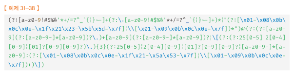

# **31.1 정규 표현식이란?**
일정 패턴을 가진 문자열의 집합을 표현하기 위해 사용하는 형식 언어다.
정규표현식은 특정 패턴과 일치하는 문자열을 검색하거나 추출 또는 치환할 수 있는 **패턴 매칭 기능**을 제공한다.

```js
// 반복문과 조건문 없이 패턴을 정의하고 테스트하는 것으로 체크 가능하다.
// 하지만 공백,여러가지 기호를 혼합해서 가독성이 좋지않다.
const tel = '010-1234-567팔'
const regExp = /^\d{3}-\d{4}-\d{4}$/;
regExp.test(tel); //false
```

<br>

# **31.2 정규 표현식의 생성**
정규표현식은 정규표현식 리터럴, RegExp 생성자 함수를 사용할 수 있다.
```/regexp/i``` 이와 같이 시작,종료(//) 패턴(regexp), 플래그(g,i,m,u,y)으로 구성된다.

[특수문자 참고](http://yoonbumtae.com/?p=1865)

```js
//정규표현식 리터럴을 이용하는 방법
const gil = 'Is this all there is?';
const regexp = /is/i;

regexp.test(target); // true

//생성자 함수를 이용하는 방법(변수를 동적으로 RegExp 객체를 생성 가능)
const count = (str,char) => (str.match(new RegExp(char, 'gi')) ?? []).length;
count('Is this all there is?','is'); // 3
```

<br>

# **31.3 RegExp 메서드**

<br>

## **31.3.1 RegExp.prototype.exec**
인수로 전달 받은 문자열에 대해 정규 표현식의 패턴을 검색하여 매칭 결과를 배열로 반환한다.
```js
const target = 'Is this all there is?';
const regExp = /is/;
regExp.exec(target);
//["is", index:5, input: "Is this all there is?", groups:undefined]
```

<br>

## **31.3.2 RegExp.prototype.test**
인수로 전달받은 문자열에 검색 결과를 불리언 값으로 변환한다.

<br>

## **31.3.3 RegExp.prototype.match**
인수로 전달받은 문자열의 검색결과를 배열로 반환한다.(exec와 비슷)
>exec와 다른점은 g 플래그 사용시 exec는 첫번째 결과값만, match는 모든 결과값을 반환한다.
 
```js
const target = 'Is this all there is?';
const regExp = /is/g;
target.match(regExp);
// ["is","is"]
```

<br>

# **31.4 플래그**
검색 방식을 설정하기 위해 사용한다.

|       플래그       |     의미      |                  설명                  |
|:---------------:|:-----------:|:------------------------------------:|
|        i        | Ignore case |         대소문자를 구별하지 않고 패턴을 검색         |
|        g        |   Global    | 대상 문자열 내에서 패턴과 일치하는 모든 문자열을 전역 검색한다. |
|        m        | Multi line  |      문자열의 행이 바뀌더라도 패턴 검색을 계속한다.      |

<br>

>플래그는 순서 상관없이 여러개를 사용할 수 있으며, 매칭 대상이 1개 이상 존재해도 첫 번째 대상만 검색하고 종료한다.

```js
const target = 'Is this all there is?';
target.match(/is/i);
// ["is", index:5, input:..., groups: undefined]
target.match(/is/g);
// ["is", "is"]
target.match(/is/ig);
// ["is", "is", "is"]
```

<br>

# **31.5 패턴**
정규 표현식은 일정한 규칙(패턴)을 가진 문자열의 집합을 표현하기 위해 사용하는 형식 언어다.
패턴은 /로 열고 닫으며 문자열의 따옴표는 생략한다.
>문자열 내에 패턴과 일치하는 문자열이 존재할 때 **'정규표현식과 매치한다'** 고 표현한다.

<br>

## **31.5.1 문자열 검색**

1. 정규표현식이 매치하는지 테스트
2. 정규표현식의 매칭 결과를 구한다.(첫번째 결과만 반환)

<br>

## **31.5.2 임의의 문자열 검색**
.(마침표)은 임의의 문자 한개를 의미한다.(내용 상관 X)

```js
// 임의의 3자리 문자열을 검색, 문자열 개수가 모자랄 경우 제외한다.
const target = 'Is this all ';
const regExp = /.../g;
target.match(regExp); //["Is ", "thi", "s a", "ll "]
```

<br>

## **31.5.3 반복 검색**
* {x,y} : 앞의 패턴이 최소 x번, 최대 y번 반복되는 문자열을 의미한다.
* {y} : 앞선 패턴이 y번 반복되는 문자열을 의미한다. {y} === {y,y} (최소, 최대값이 같다.)
* {y,} : 앞선 패턴이 최소 y번 반복되는 문자열을 의미한다.
* +&nbsp;: 앞선 패턴이 최소 한번 이상 반복 되는 문자열을 의미한다.
+ ? : 앞선 패턴이 최대 한 번(0번포함)이상 반복되는 문자열을 의미한다.

```js
const target = 'A AA B BB Aa Bb AAA AAB';
const regExp = /A{1,2}/g;
const regExp2 = /A{2}/g;
const regExp3 = /A{2,}/g;
const regExp4 = /AA+/g;
const regExp5 = /AA?A/g;

target.match(regExp); // ['A', 'AA', 'A', 'AA', 'A', 'AA']
target.match(regExp2); // ['AA', 'AA', 'AA']
target.match(regExp3); // ['AA', 'AAA','AA']
target.match(regExp4); // ['AA', 'AAA', 'AA']
target.match(regExp5); // ['AA', 'AAA', 'AA']
```

<br>

## **31.5.4 OR 검색**
```/A|B/```는 'A' 또는 'B'를 의미한다.(분해되지 않은 단어 레벨로 검색을 위해 +를 사용한다.)
```js
const target = 'A AA B BB Aa Bb';
const regExp = /A|B/g;
// /[AB]+/g; 와 동일
const regExp2 = /A+|B/g;
// A-Z(대문자) 한번이상 반복되는 패턴을 검색
const regExp3 = /[A-Z]+/g;
// A~Z, a~z 한번이상 반복되는 문자열을 전역 검색
const regExp4 = /[A-Za-z]+/g;

target.match(regExp); //["A", "A", "A", "B", "B","B", "A", "B"]
target.match(regExp2); //["A", "AA", "B", "BB", "A","B"]
target.match(regExp3); //["A", "AA", "B", "BB", "A","B"]
target.match(regExp4); //["A", "AA", "B", "BB", "Aa", "Bb"]
```
<br>

### 숫자 검색

```js
const target = 'AA BB 12,345';
const regExp = /[0-9,]+/g; // /[\d,]+/g; 과 동일
const regExp2 = /[\D,]+/g;

target.match(regExp); //["12,345"]
target.match(regExp2); //["AA BB ", ","] 공백, 특수문자 포함
```

<br>

\w는 알파벳,숫자,언더스코어를 의미한다.([A-Za-z0-9_]와 같다.)<br>
\W는 알파벳,숫자,언더스코어가 아닌 문자열을 의미한다.
```js
const target = 'Aa Bb 12,345 _$%&';
let regExp = /[\W,]+/g;

target.match(regExp); // [' ', ' ', ',', ' ', '$%&']
```

<br>

## **31.5.5 NOT 검색**
[] **내**의 ^ (서컴플렉스)는 not의 의미이다.(패턴의 대문자와 동일하다.)<br>
```/\D``` ```/\W```

<br>

## **31.5.6 시작 위치로 검색**
[] **밖**의 ^은 문자열의 시작을 의미한다.


## **31.5.7 마지막 위치로 검색**
$는 문자열의 마지막을 의마한다.

```js
const target = 'https://ssd.designfever.com';
const regExp = /^https/;
const regExp2 = /com$/;

//https로 시작하는지 검사
regExp.test(target); //true
//com으로 끝나는지 검사
regExp2.test(target); //true
```

<br>

# **31.6 자주 사용하는 정규표현식**

<br>

## **31.6.1 특정 단어로 시작하는지 검사**
```js
const url = 'https://example.com';

//http:// 또는 https://로 시작하는지 검사(둘다 동일)
/^https?:\/\//.test(url);
/^(http|https):\/\//.test(url);
```

<br>

## **31.6.2 특정 단어로 끝나는지 검사**

```js
const fileName = 'index.html';

//html로 끝나는지 검사
/html$/.test(fileName);
```

<br>

## **31.6.3 숫자로만 이루어진 문자열인지 검사**
처음(^)과 끝($)이 숫자이고 최소 한번 반복되는(+) 문자열과 매치

```js
const target = '12345';
/^\d+$/.test(fileName);//true
```

<br>

## **31.6.4 하나 이상의 공백으로 시작하는지 검사**
\s는 여러가지 공백 문자(스페이스,탭 등)를 의미한다. [\t\r\n\v\f]과 동일하다.

```js
const target = ' hey!';
/^[\s]+/.test(target);
```

<br>

## **31.6.5 아이디로 사용 가능한지 검사**
```js
const id = 'abc123';
//A~Z,a~z,0~9(알파벳, 숫자)로 시작하고 끝나며 4~10자리인지 검사한다.
//(최소 4번 최대 10번 반복되는 문자열)
/^[A-Za-z0-9]{4,10}$/.test(id); 
```

<br>

## **31.6.6 메일 주소 형식에 맞는지 검사**

```js
const email = 'ungmo2@gmail.com';
/^[0-9a-zA-z]([-_\.]?[0-9a-zA-Z])*@[0-9a-zA-Z]([-_\.]?[0-9a-zA-Z])*\.[a-zA-Z]{2,3}$/.test(email);
```

<br>

```인터넷 메세지 형식 규약(RFC5322)에 맞는 정교한 패턴```



<br>

## **31.6.7 핸드폰 번호 형식에 맞는지 검사**

```js
const cellphone = '010-1234-5678';
/^\d{3}-\d{3,4}-\d{4}$/.test(cellphone);
```

<br>

## **31.6.8 특수 문자 포함 여부 검사**
특수문자가 포함되어 있는지 검사한다.(A-Za-z0-9 이외의 문자)

```js
const target = 'abc#123';
(/[^A-Za-z0-9]/gi).test(target); //true

//특수문자를 선택적으로 검사
(/[\{\}\[\]\/?.,ㅣ:|\)*~`!^\-_+<>@\#$%&\\\=\(\'\"]/gi).test(target); //true

//한글검사
/[ㄱ-ㅎ|ㅏ-ㅣ|가-힣]/.test(target)//false
```
<br>

특수 문자를 제거할 때는 ```String.prototype.replace```메서드를 사용한다.

```js
const target = 'abc#123';
target.replace(/[^A-Za-z0-9]/gi,''); // abc123
```