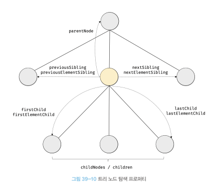
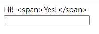
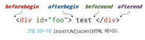

 DOM은 HTMl 문서의 계층적 구조와 정보를 표현하며 이를 제어할 수 있는 API, 즉 프로퍼티와 메서드를 제공하는 트리 자료구조다.

# **39.1 노드**

<br>

## **39.1.1 HTML 요소와 노드객체 **
HTML 요소간에는 중첩 관계에 의해 계층적인 부자 관계가 형성된다. 이러한 관계를 반영하여 HTMl 문서의 구성 요소인 HTML 요소를 객체화한 모든 노드 객체들을 트리 자료 구조로 구성한다.

<br>

### `트리 자료구조` <br>
트리 자료구조는 부모노드와 자식노드로 구성되어 노드간 계층 구조를 표현하는 비선형 자료구조(하나의 자료뒤에 여러 개의 자료가 존재할 수 있는 자료구조)를 말한다.

* 하나의 최상위 노드에서 시작
* 최상위 노드는 루트 노트라 한다.
* 루트 노드는 0개 이상의 자식노드를 갖는다.(자식 노드가 없으면 리프노드라 한다.)

> 노드 객체들로 구성된 트리 자료구조를 **DOM(DOM 트리)** 이라 한다.

<br>

## **39.1.2 노드 객체의 타입**
DOM은 노드객체의 계층적인 구조로 구성된다. 노드 객체는 종류가 있고 상속 구조를 갖는다.

<br>

### `문서노드`
DOM 트리의 루트 노드로서 document 객체를 가리킨다. (window.document or document로 참조할 수 있다.)

HTML 문서당 document 객체는 유일하다. 요소, 어트리뷰트, 텍스트 노드에 접근하려면 문서 노드를 통해햐한다.

<br>

### `요소 노드`
HTML 요소를 가리키는 객체, HTML 요소간의 부자 관계를 가지며 정보를 구조화한다. (문서의 구조를 표현한다.)

<br>

### `어트리뷰트 노드`
HTML 요소의 어트리뷰트를 가리키는 객체, 부모 노드가 없으므로 요소 노드의 형제 노드는 아니다. 따라서 어트리뷰트 노드에 접근하여 어트리뷰트를 참조하거나 변경하려면 요소 노드에 접근해야 한다.

<br>

### `텍스트 노드`
HTML 요소의 어트리뷰트를 가리키는 객체다. 요소 노드의 자식 노드이며, DOM트리의 최종단이다.

<br>

## **39.1.3 노드 객체의 상속 구조**
DOM을 구성하는 노드객체는 자신의 구조와 정보를 제어할수 있는 DOM API를 사용할 수 있으며 이를 통해 자신의 부모, 형제, 자식을 탐색할 수 있으며, 자신의 어트리뷰트와 텍스트를 조작할 수도 있다.

노드객체도 자바스크립트 객체이므로 프로토타입에 의한 상속 구조를 갖는다.

* (모든 노드 객체는) Object, EventTarget, Node 인터페이스를 상속 받는다.

* 문서노드는 Document, HTMLDocument 인터페이스를 상속받고, 어트리뷰트 노드는 Attr, 텍스트노드는 CharacterData 인터페이스를 각각 상속 받는다.

* 요소노드는 ELement 인터페이스를 상속받는다. Element 인터페이스는 HTMLElement와 태그별 세분화된 인터페이스(HTMLHtmlElement, HTMLHeadELement, HTMLBodyElement, HTMLUListElement 등)를 상속받는다.

>요소노드객체는 프로토타입 체인에 있는 모든 프로토타입의 프로퍼티나 메서드를 상속받아 사용할 수 있다. (노드 객체는 공통된 기능일수록 프로토타입 체인의 상위에, 개별적 고유 기능일수록 프로토타입 체인 하위에 프로토타입 체인을 구축하여 노드객체에 필요한 프로퍼티와 메서드를 제공하는 상속 구조를 갖는다.)
> 
> **노드 타입에 따라 필요한 기능을 프로퍼티와 메서드의 집한인 DOM API로 제공한다. 이 DOM API를 통해 HTMl의 구조나 내용 또는 스타일 등을 동적으로 조작할 수 있다.**

📌 노드 객체의 상속구조는 개발자 도구의 Elements 패널 우측의 Properties 패널에서 확인할 수 있다.~~(나는 왜 못찾는것인가...)~~

<br>

# **39.2 요소 노드 취득**
요소 노드의 취득은 HTML 요소를 조작하는 시작점이다.

<br>

## **39.2.1 id를 이용한 요소 노드 취득**
id값을 이용한 요소 노드취득은 중복된 id값이 있더라도 첫번쨰 요소 노드만 반환한다.(하지만 id값은 유일한 값이어야 한다.)

HTML 요소에 id 어트리뷰트를 부여하면 id값과 동일한 이름의 전역변수가 암묵적으로 선언되고 해당 노드 객체가 할당되는 부수 효과가 있다.

```html
<div id="gil"></div>
<div id="gil2"></div>

<script>
    console.log(gil === document.getElementById("gil")) //true
    delete gil;
    console.log(gil); // <div id="gil"></div>
    
    //id값과 동일한 이름의 전역변수가 있으면
    //노드객체가 재할당되지 않는다.
    let gil2 = 1;
    console.log(gil2);//1
    
</script>
```

<br>

## **39.2.2 태그 이름을 이용한 요소 노드 취득**
getElementsByTagName 메서드는 인수로 전달한 태그이름을 가진 모든 요소노드들을 탐색하여 반환한다.(DOM컬렉션 객체인 HTMLCollection 객체를 반환)

<br>

## **39.2.3 class를 이용한 요소 노드 취득**
getElementsByClassName 메서드는 인수로 전달한 class 어트리뷰트 값(클래스명)을 가진 모든 요소노드들을 탐색하여 반환한다.(DOM컬렉션 객체인 HTMLCollection 객체를 반환)

<br>

## **39.2.4 CSS 선택자를 이용한 요소 노드 취득**
querySelector 메서드는 인수로 전달한 CSS 선택자를 만족 시키는 하나의 요소노드를 탐색하여 반환한다.(NodeList 객체를 반환)

* (CSS선택자를 만족시키는 요소 노드가 )여러 개인 경우 첫번째 요소노드만 반환
* (CSS선택자를 만족시키는 요소 노드가) 존재하지 않는 경우 null 반환(빈 NodeList 객체 반환)
* CSS 선택자가 문법에 맞지 않는 경우 DOMException 에러가 발생한다.
* HTML문서의 모든 요소 노드를 취득하려면 querySelectorAll 메서드에 *을 전달한다.

> id값이 있는 요소 노드를 취득할때는 getElementById를 사용하고 그외에는 querySelector, querySelectorAll를 사용하는 것을 권장한다.

```html
<div id="gil">
    <ul>
        <li></li>
        <li></li>
    </ul>
</div>

<script >
    const targetEl = document.getElementById('gil');
    //li태그의 요소들을 유사배열로 반환(이터러블)
    document.getElementsByName('li');
    targetEl.getElementsByName('li');
    //모든 태그 요소들을 유사배열로 반환
    document.getElementsByName('*');
    targetEl.getElementsByName('*');
    
    //요소가 존재하지 않는경우 빈 HTMLCollection 객체를 반환한다.
    targetEl.getElementsByName('a');
</script>
```

<br>

## **39.2.5 특정 요소 노드를 취득할 수 있는지 확인**
matches 메서드는 인수로 전달한 CSS 선택자를 특정 요소 노드로 취득할 수 있는지 확인한다.
```js
$target.matches('#fruit > .apple')//true
```

<br>

## **39.2.6 HTMLCollection과 NodeList**
HTMLCollection과 NodeList는 노드객체의 상태 변화를 실시간으로 반영하는 살아있는 객체라는 것이 중요한 특징이다.

<br>

### **`HTMLCollection`**
HTMLCollection 객체는 실시간으로 노드객체의 상태를 반영하여 요소를 제거하기때문에 for문으로 순회할때 주의해야 한다.
```html
<div class="red">A</div>
<div class="red">B</div>
<div class="red">C</div>
<script >
    //HTMLCollection은 실시간으로 반영되기 때문에
    //for문을 돌리면 2번째 배열요소를 제외한 1,3번째 배열요소만 반영된다. 
    const target = document.getElementsByClassName('red');
    for(let i = 0; i < target.length; i++){
        target[i].className = 'blue';
    }

    //for문을 역방향으로 순회하거나 while문을 쓰면 하면 해결된다.
    for(let i = target.length -1; i>=0; i--){
        target[i].className = 'blue';
    }
    
    //HTMLCollection 객체를 배열로 변환해도 해결할 수 있다.
    //고차함수(forEach, map, filter, reduce등)도 사용할 수 있다.
    [...target].forEach(el => el.className = 'blue');
</script>
```

<br>

### **`NodeList`**
HTMLCollection 객체의 부작용(실시간 반영되기 때문에 순회시 모든 노드요소가 적용 되지않을 수 있는것)을 해결하기위해 querySelectorAll 메서드를 사용하는 방법도 있다.

querySelectorAll 메서드는 DOM 컬렉션 객체인 NodeList를 반환(실시간으로 노드객체의 상태 변경을 반영하지 않음)한다.

```html
<ul id="fruits">
    <li>A</li>
    <li>B</li>
</ul>
<script >
    const $fruits = document.getElementById('fruits');
    
    //childNodes프로퍼티는 NodeList를 실시간 반영하므로
    //주의가 필요하다.
    const{childNodes} = $fruits;
    console.log(childNodes); //NodeList(5)[text, li, text, li, text]
    
    for(let i =0; i < childNodes.length; i++){
        $fruits.removeChild(childNodes[i]);
    }
    //모든 자식노드가 삭제되지 않았다.
    console.log(childNodes); //NodeList(2)[li,li]
</script>
```

> 예상과 다르게 동작할 우려가 있어 **노드객체의 상태 변경과 상관없이 안전하게 DOM 컬렉션을 사용하려면 HTMLCollection이나 NodeList 객체를 배열로 반환하여 사용하는 것을 권장한다.**

```js
//스프레드 문법을 이용한 자식 노드요소 삭제
[...childNodes].forEach(childNode =>{
    $fruits.removeChild(childNodes);
});
```

<br>

# **39.3 노드 탐색**
취득한 요소 노드를 기점으로 DOM 트리의 노드를 옮겨 다니며 부모, 형제, 자식 노드 등을 탐색해야 할 때가 있다.

```html
// 1. ul 요소 노드 취득
<ul id="fruit">
    //2. 자식노드 모두 탐색 or 자식노드 중 하나만 탐색
    <li class="a">A</li>
    //3. b 요소는 2개의 형제 요소와 부모 요소를 가지므로 b요소노드를 취득 후
    //형제 노드를 탐색하거나 부모 노드를 탐색한다.
    <li class="b">B</li>
    <li class="c">C</li>
</ul>
```



>이처럼 DOM 트리 상의 노드를 탐색할 수 있도록 Node, Element 인터페이스는 트리 탐색 프로퍼티를 제공한다.

parentNode, previousSibling, firstChild, childNodes 프로퍼티는 Node.prototype이 제공하고, 프로퍼티 키에 Element가 포함된 previousElementSibling, nextElementSibling과 children 프로퍼티는 Element.prototype이 제공한다.

📌 노드 탐색 프로퍼티는 모두 접근자 프로퍼티다. 단, 노드 탐색 프로퍼티는 setter없이 getter만 존재하여 참조만 가능한 읽기 전용 접근자 프로퍼티다.

<br>

## **39.3.1 공백 텍스트 노드**
HTML요소 사이의 스페이스, 탭, 줄바꿈(개행)등의 공백문자는 텍스트 노드(공백텍스트노드)를 생성한다.

<br>

## **39.3.2 자식 노드 탐색**
| 프로퍼티                                | 설명                                                         |
|:------------------------------------|:-----------------------------------------------------------|
| Node.prototype.childNodes           | 자식노드를 모두 탐색하여 NodeList에 담아 반환(텍스트 노드 포함)                   |
| Element.prototype.children          | 자식 노드 중에서 요소 노드만 모두 탐색하여HTMLCollection에 담아 반환(텍스트 노드 포함 X) |
| Node.prototype.firstChild           | 첫번째 자식 노드를 반환(텍스트노드 or 요소노드다.)                             |
| Node.prototype.lastChild            | 마지막 자식 노드를 반환(텍스트노드 or 요소노드다.)                             |
| Element.prototype.firstElementChild | 첫번째 자식 '요소' 노드를 반환(요소노드만 반환)                               |
| Element.prototype.lastElementChild  | 마지막 자식 '요소' 노드를 반환(요소노드만 반환) |

```html
<ul id="fruits">
    <li class="a">A</li>
    <li class="b">B</li>
    <li class="c">C</li>
</ul>
<script >
    const $fruit = document.getElementById('fruit');

    //NodeList(7)[text, li.a, text, li.b, text, li.c, text]
    console.log($fruit.childNodes);
    
    //HTMLCollection(3)[li.a, li.b, li.c]
    console.log($fruit.children);
    
    console.log($fruit.firstChild);//#text
    console.log($fruit.lastChild); //#text
    console.log($fruit.firstElementChild); //li.a
    console.log($fruit.lastElementChild); //li.c
</script>
```

<br>

## **39.3.3 자식 노드 존재 확인**
Node.prototype.hasChildNodes 메서드는 텍스트 노드를 포함한 자식 노드가 존재하는지 확인 한다. 

자식노드들 중 텍스트 노드가 아닌 요소 노드가 존재 하는지 확인은 children.length, childElementCount를 사용하면된다.

```js
$fruit.hasChildNodes(); //true or false
!!$fruit.children.length; //0 (false)
!!$fruit.childElementCount; //0 (false)
```

<br>

## **39.3.4 요소 노드의 텍스트 노드 탐색**
firstChild 프로퍼티는 요소노드의 텍스트 노드로 접근할 수 있다. (텍스트 노드나 요소노드를 반환)

<br>

## **39.3.5 부모 노드 탐색**
Node.prototype.parentNode 프로퍼티를 사용하여 부모노드(리프노드)를 탐색한다.

<br>

## **39.3.6 형제 노드 탐색**
아래 노드 탐색 프로퍼티는 어트리뷰트 노드를 제외한 텍스트노드, 요소노드만 반환한다.

| 프로퍼티       | 설명                                 |
|:-----------------|:-----------------------------------|
| Node.prototype.previousSibling           | 자신의 이전 형제 노드를 탐색하여 반환(텍스트노드, 요소노드) |
| Node.prototype.nextSibling               | 자신의 다음 형제 노드를 탐색하여 반환(텍스트노드, 요소노드) |
| Element.prototype.previousElementSibling | 자신의 이전 형제 '요소'노드를 탐색하여 반환(요소노드)    |
| Element.prototype.nextElementSibling     | 자신의 다음 형제 '요소'노드를 탐색하여 반환(요소노드     |

<br>

# **39.4 노드 정보 취득**

| 프로퍼티                    | 설명                                                                                                                                                                     |
|:------------------------|:-----------------------------------------------------------------------------------------------------------------------------------------------------------------------|
| Node.prototype.nodeType | 노드 타입을나타내는 상수를 반환한다.<br/>* Node.ELEMENT_NODE: 요소 노드 타입을 나타내는 상수 1을 반환<br/>* Node.TEXT_NODE: 텍스트 노드 타입을 나타내는 상수 3을 반환<br/>* Node.DOCUMENT_NODE: 문서 노드 타입을 나타내는 상수 9를 반환 |
| Node.prototype.nodeName | 노드의 이름을 문자열로 반환<br/>* 요소노드: 대문자 문자열로 태그이름을 반환<br/>* 텍스트 노드: 문자열 "#text"를 반환<br/>* 문서 노드: 문자열 "#document"를 반환                                                           |

```js
console.log(document.nodeType); //9
console.log(document.nodeName); // #document
console.log(idTag.nodeName); // 1
console.log(idTag.nodeType); // DIV
console.log(idTag.firstChild.nodeType); // 3
console.log(idTag.firstChild.nodeName); // #text
```

<br>

# **39.5 요소 노드의 텍스트 조작**

<br>

## **39.5.1 nodeValue**
nodeValue 프로퍼티는 setter, getter 모두 존재하는 접근자 프로퍼티다.(지금까지 살펴본 프로퍼티는 모두 읽기 전용 접근자 프로퍼티)

노드객체의 nodeValue 프로퍼티를 참조하면 노드객체의 값을 반환한다.(텍스트 노드의 텍스트 반환) 문서노드나 요소노드의 nodeValue 프로퍼티를 참조하면 null을 반환한다.

<br>

### `요소노드의 텍스트 변경 방법`<br>
1. 텍스트를 변경할 요소 노드를 취득한 다음, 취득한 요소 노드의 텍스트 노드를 탐색한다.(firstChild 프로퍼티를 사용하여 탐색)
2. 탐색한 텍스트 노드의 nodeValue 프로퍼티를 사용하여 텍스트 노드의 값을 변경한다.

<br>

## **39.5.2 textContent**
setter, getter 모두가 존재하는 접근자 프로퍼티다. 요소 노드의 텍스트와 모든 자손 노드의 텍스트를 모두 취득하거나 변경한다.(HTML 마크업은 무시된다.)

콘텐츠 영역에 자식 노드가 없고 텍스트만 존재한다면 nodeValue 프로퍼티보단 textContent 프로퍼티를 사용하는것이 더 간단하다. **(nodeValue 프로퍼티를 사용하면 텍스트 노드만 취득하지 않으면 null을 반환하기 때문이다.)**

```html
<div id="target">hi!</div>

<script >
    document.getElementById('target').textContent // hi
    
    //하지만 HTML 마크업이 파싱 되지않아 태그명을 텍스트 노드(텍스트)로 인식한다.
    document.getElementById('target').textContent = 'hi! <span>there</span>';
    //hi! <span>there</span> (span 태그는 태그가 아니라 문자열이다.)
    document.getElementById('target').textContent
</script>
```


<br>HTML 마크업은 문자열이다.

<br>

> **innerText 프로퍼티를 사용을 권장하지 않는 이유.**
> * CSS에 순종적이다. 예를 들어 visibility:hidden으로 지정된 요소노드의 텍스트를 반환하지 않는다.
> * CSS를 고려해야 하므로 textContent 프로퍼티보다 느리다.

<br>

# **39.6 DOM 조작**
DOM 조작은 성능에 영향(리플로우, 리페인트)을 주기 때문에 성능 최적화를 위해 주의해서 다루어야 한다.

<br>

## **39.6.1 innerHTML**
HTML마크업이 포함된 문자열을 그대로 반환한다. 요소노드의 모든자식노드가 제거되고 할당된 값을 HTML마크업이 파싱되어 자식노드로 DOM에 반영된다.

```js
//노드추가
target.innerHTML += '<li class="banana">A</li>';
//노드교체
target.innerHTML = '<li class="banana">A</li>';
//노드삭제
target.innerHTML = '';

//크로스 사이트 스크립팅 공격에 취약하므로 위험할 수 있다.
//HTML5는 innerHTML 프로퍼티로 삽입된 script요소 내의 js를 실행하지 않는다.
target.innerHTML = '<script>alert(document.cookie)</script>';
```

>sanitize를 사용하면 잠재적 위험을 내포한 HTML 마크업을 제거한다.
> `DOMPurify.sanitize('<a onerror="alert(document.cookie)"></a>') // => <a></a>`

**단점1.** innerHTML은 요소노드를 추가를 하더라도 기존에 있던 요소 즉 모든 요소를 다 삭제후 다시 생성하여 자식요소로 추가한다.

```js
//노드추가
//자식요소를 모두 삭제하고 다시 생성한다.
target.innerHTML += '<li class="banana">A</li>';
```

<br>

**단점2.** 새로운 요소를 삽입할 떄 위치를 지정할 수 없다.

<br>

## **39.6.2 insertAdjacentHTML 메서드**
insertAdjacentHTML(position, DOMString)메서드는 **기존 요소를 제거하지 않고, 위치를 지정해 새로운 요소를 삽입한다.**

첫번째 인수로 위치지정은 beforebegin, afterbegin, beforeend, afterend 4가지를 할당 할수 있다.

두번째 인수로 HTML 마크업 문자열을 할당한다.



```js
$target.insertAdjacentHTML('beforeend','<p>beforeend</p>');
```

<br>

## **39.6.3 노드 생성과 추가**
DOM은 노드를 직접 생성/삽입/삭제/치환 하는 메서드를 제공한다.

```js
const getTarget = document.getElementById('target');

// 1. 요소 노드 생성
const $li = document.createElement('li');

// 2. 텍스트 노드 생성
const textNode = document.createTextNode('banana');

// 3. 텍스트 노드를 $li 요소 노드의 자식 노드로 추가
$li.appendChild(textNode);

// 4. $li 요소 노드를 target 요소 노드의 마지막 자식 노드로 추가
getTarget.appendChild($li);
```

<br>

### **`1. 요소 노드 생성`**
createElement 메서드는 요소 노드를 생성하여 반환한다. 태그이름을 나타내는 문자열을 인수로 전달한다.

createElement 메서드는 요소 노드를 생성할뿐 DOM에 추가하지 않는다. 따라서 **이후에 생성된 요소노드를 DOM에 추가하는 처리가 별도로 필요하다.** 

<br>

### **`2. 텍스트 노드 생성`**
createTextNode 메서드는 텍스트 노드를 생성하여 반환한다. 텍스트 노드의 값으로 사용할 문자열을 인수로 전달한다.

홀로 존재하는 상태이기 때문에, 요소 노드에 추가하는 처리가 별도로 필요하다.

<br>

### **`3. 텍스트 노드를 요소 노드의 자식 노드로 추가`**
appendChild 메서드로 호출한 노드의 마지막 자식으로 인수로 전달한 노드를 추가한다. 

인수로 createTextNode 메서드로 생성한 텍스트 노드를 전달하면 appendChild 메서드를 호출한 노드의 마지막 자식 노드로 텍스트 노드가 추가된다.

📌 요소 노드에 자식 노드가 하나도 없는경우 textContent 프로퍼티를 사용하는 편이 더 간편하다.

```js
$li.textContent = 'banana';
```

<br>

### **`4. 요소 노드를 DOM에 추가`**
텍스트 노드와 부자 관계로 연결한 요소 노드를 target 요소 노드의 마지막 자식 요소로 추가한다.

```js
getTarget.appendChild($li);
```

>이 과정에서 생성한 요소 노드가 DOM에 추가된다.(리플로우, 리페인트 실행)
 
<br>

## **39.6.4 복수의 노드 생성과 추가**
아래의 예시는 리플로우, 리페인트가 3번 실행된다. **DOM을 변경하는 것은 높은 비용이 드는 처리이므로 가급적 횟수를 줄이는 편이 성능에 유리하다.**
```js
//DOM 세 번 변경
['A','B','C'].forEach(el => {
    //1. 요소 노드 생성
    const $li = document.createElement('li');
    //2. 텍스트 노드 생성
    const textNode = document.createTextNode(el);
    //3. 텍스트 노드를 $li 요소 노드의 자식 노드로 추가
    $li.appendChild(textNode);
    //4. $li 요소 노드를 target 마지막 자식 노드로 추가
    target.appendChild($li);
});

//DOM 한 번 변경
//1. 컨테이너 요소 노드 생성
// target 요소에 자식으로 추가하면 DOM은 한 번만 변경된다.
// DOM 요소에 div를 추가하는 처리를 하기전에 이미 li는 추가된 상태이므로
const $container = document.createElement('div');

['A','B','C'].forEach(el => {
    //2. 요소 노드 생성
    const $li = document.createElement('li');
    //3. 텍스트 노드 생성
    const textNode = document.createTextNode(el);
    //4. 텍스트 노드를 $li 요소 노드의 자식 노드로 추가
    $li.appendChild(textNode);
    //5. $li 요소 노드를 target 마지막 자식 노드로 추가
    $container.appendChild($li);
});

//6. DOM요소로 추가한다.(이때 한번 DOM 요소를 변경한다.)
target.appendChild($container);
```

>위의 예제는 불필요한 div를 생성한다는 부작용이 있다. 이는 DocumentFragment 노드를 통해 해결할 수 있다.

<br>

### **`DocumentFragment`**
자식노드들의 부모 노드로서 별도의 서브 DOM을 구성하여 기존 DOM에 추가하기 위한 용도로 사용한다. DocumentFragment 노드를 DOM에 추가하면 자신은 제거되고 자신의 자식 노드만 DOM에 추가된다.

```js
//$container 대신 createDocumentFragment 메서드를 사용하면된다.
//서브 DOM을 생성하여 자식 노드들을 추가하고 기존 DOM으로 추가한다.
const $fragment = document.createDocumentFragment();
```

<br>

## **39.6.5 노드 삽입**

<br>

### **`마지막 노드로 추가`**
appendChild 메서드는 인수로 전달받은 노드를 자신을 호출한 노드의 마지막 자식 노드로 DOM에 추가한다.

<br>

### **`지정한 위체에 노드 삽입`**
insertBefore(newNode, childNode) 메서드는 첫번째 인수로 전달받은 노드를 두번쨰 인수로 전달받은 노드 앞에 삽입한다.

```js
//마지막 자식 요소 앞에 추가
$target.insertBefore($li, $target.lastElementChild);

//반드시 inserBefore 메서드를 호출한 노드의 자식 노드이어야 하며 그렇지 않으면 DOMException에러가 발생한다.
$target.insertBefore($li, document.querySelector('div')); //DOMException

//두번쨰 인수가 null이면 appendChild 처럼 마지막 자식 노드로 추가된다.
$target.insertBefore($li, null);
```

<br>

## **39.6.6 노드 이동**
이미 존재하는 노드를 appendChild 또는 insertBefore 메서드를 사용하여 DOM에 다시 추가하면 현재 위치에서 노드를 제거하고 새로운 위치에 노드를 추가하여 노드가 이동된다.

<br>

## **39.6.7 노드 복사**
Node.prototype.cloneNode([deep:true | false]) 메서드는 노드의 사본을 생성하여 반환한다.

true면 모든 자손 노드가 포함된 사본, false는 노드 자신만의 사본을 생성한다.(텍스트 노드도 미포함)

<br>

## **39.6.8 노드 교체**
Node.prototype.replaceChild(newChild, oldChild) 메서드는 자신을 호출한 노드의 자식 노드를 다른 노드로 교체한다. (oldChild 노드는 호출한 노드의 자식 노드이어야 한다.)

<br>

## **39.6.9 노드 삭제**
Node.prototype.removeChild(child) 메서드는 인수로 전달한 노드를 DOM에서 삭제한다. (호출한 노드이 자식 노드이어야 한다.)

<br>

# **39.7 어트리뷰트**

<br>

## **39.7.1 어트리뷰트 노드와 attributes 프로퍼티**
글로벌 어트리뷰트(id, class, style, title, lang, tabindex, draggable, hidden 등)와 이벤트 핸들러 어트리뷰트(onclick, onchange, onfocus, onblur, oninput, onkeypress 등)는 모든 HTML 요소에서 공통적으로 사용할 수 있지만 특정 HTML 요소에만 한정적으로 사용 가능한 어트리뷰트(type, value, checked 등)도 있다.

HTML 어트리뷰트는 어트리뷰트 노드로 변환되어 요소 노드와 연결 된다. 어트리뷰트 하나당 하나의 어트리뷰트 노드가 생성된다.

모든 어트리뷰트 노드의 참조는 유사 배열객체이자 이터러블인 **NameNodeMap 객체에 담겨서 요소노드의 attributes 프로퍼티에 저장된다.**

<br>

## **39.7.2 HTML 어트리뷰트 조작**
어트리뷰트 값을 취득할 수 있지만 변경할 수 없다. attributes.id.value와 같이 값을 취득할 수 있다.

Element.prototype.getAttribute/setAttribute 메서드를 사용하면 요소노드에서 메서드를 통해 직접 값을 취득하거나 변경할 수 있다.

```js
//value 어트리뷰트 값 취득
$input.getAttribute('value');
//value 어트리뷰트 값 변경
$input.setAttribute('value','foo');

//value 어트리뷰트 존재 확인
$input.hasAttribute('value'); //true
//value 어트리뷰트 삭제
$input.removeAttribute('value');
```

<br>

## **39.7.3 HTML 어트리뷰트 vs. DOM 프로퍼티**
요소노드 객체에는 DOM프로퍼티가 존재하며 초기값으로 가지고 있다.
DOM 프로퍼티는 setter,getter 모두가 존재하는 접근자 프로퍼티이어서 참조와 변경이 가능하다.

**요소노드의 attributes 프로퍼티, DOM 프로퍼티 이렇게 두곳에서 관리 되는것 같지만 그렇지 않다.**

HTML 어트리뷰트의 역할은 HTML 요소의 초기 상태를 지정하는 것이다. HTML 어트리뷰트 값은 HTML요소의 초기상태를 의미하며 이는 변하지 않는다.

>따라서 요소 노드의 초기상태는 어트리뷰트 노드가 관리(새로고침했을때 초기값)하며, 요소노드의 최신상태는 DOM 프로퍼티가 관리(변화는 값 관리)한다.
 
<br>

### **`어트리뷰트 노드`**
HTML요소의 초기상태는 어트리뷰트 노드에서 관리한다. 사용자 입력에 의해 상태가 변경되어도 변하지 않고 값을 취득하거나 변경하려면 getAttribute/setAttribute 메서드를 사용한다.

getAttribute 메서드는 언제나 값이 같으며, setAtrribute 메서드를 사용하면 HTML 요소에 지정한 어트리뷰트값(초기상태 값)을 변경한다.

<br>

### **`DOM 프로퍼티`**
사용자가 입력에 의해 상태가 변경되는 값을 관리한다.

사용자의 입력과 관계가 없는 id 어트리뷰트와 id 프로퍼티는 항상 동일한 값을 유지한다. 즉 id 어트리뷰트 값이 변하면 id 프로퍼티값도 변하고 반대도 마찬가지다. (사용자 입력에 의한 상태 변화와 관계있는 DOM 프로퍼티만 최신 상태 값을 관리한다.)

<br>

### **`HTML 어트리뷰트와 DOM 프로퍼티의 대응 관계`**
* id어트리뷰트와 id프로퍼티는 1:1대응하며 동일한 값으로 연동한다.
* input 요소의 value 어트리뷰트는 value 프로퍼티와 1:1대응하지만, 각각 초기상태, 최신상태를 갖는다.
* class 어트리뷰트는 className, classList 프로퍼티와 대응한다.
* for 어트리뷰트는 htmlFor 프로퍼티와 1:1대응한다.
* td 요소의 colspan 어트리뷰트는 대응하는 프로퍼티가 존재하지 않는다.
* textContent 프로퍼티는 대응하는 어트리뷰트가 존재하지 않는다.
* 어트리뷰트 이름은 대소문자를 구별하지 않지만 대응하는 프로퍼티 키는 카멜케이스를 따른다.

<br>

### **`DOM 프로퍼티 값의 타입`**
getAttribute 메서드로 취득한 어트리뷰트값은 무조건 문자열이지만,  DOM 프로퍼티의 값의 타입은 문자열이 아닌 경우도 있다. (예를들면 checkbox 프로퍼티는 값은 불리언 타입이다.)

<br>

## **39.7.4 data 어트리뷰트와 dataset 프로퍼티**
data 어트리뷰트와 dataset 프로퍼티를 사용하면 HTML 요소에 정의한 사용자 정의 어트리뷰트와 자바스크립트 간에 데이터를 교환할 수 있다.

```html
//data- 를 접두사로 두고 임의의 이름을 붙여 사용한다.
<li data-gil="hi" data-young="hihihi"></li>
```

data 어트리뷰트의 값은 HTMLElement.dataset 프로퍼티로 취득할 수 있다.

data 어트리뷰트의 정보를 제공하는 DOMStringMap 객체를 반환하며, data- 접두사 다음에 이름을 카멜케이스로 변환한 프로퍼티를 가지고 있다. 이 프로퍼티로 data 어트리뷰트의 값을 취득하거나 변경할 수 있다.

```js
const target = document.querySelector('li');
//값 취득
console.log(target.dataset.gil); //hi
//값 변경
target.dataset.gil = 'hellow';
//HTML 요소에 data 값 추가
target.dataset.kim = '123';
```

<br>

# **39.8 스타일**

<br>

## **39.8.1 인라인 스타일 조작**
HTMLElement.prototype.style 프로퍼티는 setter,getter 모두가 존재하여 요소노드의 인라인 스타일을 취득하거나 추가 또는 변경한다.

CSSStyleDeclaration 타입의 객체를 반환한다. CSS 프로퍼티에 대응하는 프로퍼티를 가지고 있으며 이 프로퍼티에 값을 할당하면 해당 CSS프로퍼티가 인라인 스타일로 HTML 요소가 추가되거나 변경된다.

```js
//CSSStyleDeclaration 사용
target.style.backgroundColor = 'yellow';
//CSS프로퍼티 사용
target.style['background-color'] = 'yellow';
//단위가 필요한 CSS 프로퍼티의 값은 단위가 없으면 적용되지 않는다.
target.style.width = '100'; //적용되지않음.
```

<br>

## **39.8.2 클래스 조작**

<br>

### **`className`**
className 프로퍼티는 setter와 getter 모두 존재하는 접근자 프로퍼티다.(값 취득, 변경 가능)

className 프로퍼티를 참조하면 class 어트리뷰트 값을 문자열로 반환하고, 문자열을 할당하면 class 어트리뷰트 값을 할당한 문자열로 변경한다.

```js
//클래스 이름이 여러개일 경우 공백이 추가되어 불편하다.
console.log($target.className); //box red
```

<br>

### **`classList`**
Element.prototype.classList 프로퍼티는 class 어트리뷰트의 정보를 담은 DOMTokenList 객체를 반환한다.

```js
//클래스 이름이 여러개일 경우 공백이 추가되어 불편하다.
console.log($target.classList); //{length:2, value:"box red", 0:"box",1:"red"}
```

DOMTokenList 객체는 다음과 같이 유용한 메서드들을 제공한다.

1. add
```js
//인수로 전달한 1개 이상의 문자열을 class 어트리뷰트 값으로 추가한다.
$target.classList.add('gil');
```

2. remove
```js
//인수로 전달한 1개 이상의 문자열과 일치한 클래스를 class 어트리뷰트 값에서 삭제한다.
$target.classList.remove('gil');
```

3. item
```js
//인수로 전달한 index에 해당하는 클래스 이름를 class 어트리뷰트에서 반환한다.
$target.classList.item(0);//gil
```

4. contains
```js
//인수로 전달한 문자열과 일치하는 클래스가 class에 포함돼 있는지 확인한다.
$target.classList.contains('gil');//true
```

5. replace
```js
//인수로 전달한 문자열과 일치하는 클래스가 class에 포함돼 있는지 확인한다.
$target.classList.contains('gil');//true
```