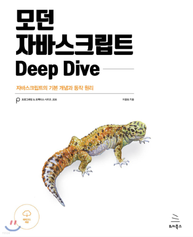

# ✨ DF Javascript Study 

    

## 스터디원
### DF VID
|    |  |  |  |
|:-----------------------------------------------------------------------------------------------------------:|:---------------------------------------------------------------------------------------------------------------:|:-------------------------------------------------------------------------------------------------------------:|:---------------------------------------------------------------------------------------------------------------:|
|                                                     김영길                                                     | 양세영                                                                                                           | 주슬기                                                                                                         | 서문명수                                                                                                          |

## 스터디 소개 
- 모던 자바스크립트 Deep Dive를 함께 읽으며 공부하는 스터디

## 진행 방식

### ✔️ Goal
- javascript의 동작원리를 학습하고 설명할 수 있다.

### ✔️ When, Where
- 매주 목요일 저녁 6시 30분(회사 일정에 따라 유동적으로 바뀔 수 있음)
- 지하 회의실

### ✔️ How 
- 매주 목요일까지 정해진 챕터를 읽고 정리해서 main branch의 자신의 폴더에 올린 후,
- 해당 챕터에 대한 문제를 issue에 등록한다.
- 발표자는 해당 챕터를 설명하고 스터디원들은 자유롭게 질문하고 토론할 수 있다.
- 설명이 끝난 후 문제 풀이자를 선정하고 정답을 발표한다.
    
## 진행 과정

주차별 과제 내용 및 발표자

### 1회차(2022.05.12)
- 10장 객체 리터럴

### 2회차(2022.05.19)
- 4장 변수
- 5장 표현식과 문
- 6장 데이터 타입

### ~~3회차(2022.05.26)~~
~~바쁜 업무로 쉬어갑니다ㅠㅠ~~

### 3회차(2022.06.02)
- 7장 연산자
- 8장 제어문
- 9장 타입 변환과 단축 평가

### ~~4회차(2022.06.09)~~
~~- 11장 원시 값과 객체의 비교~~
 
업무상 패쑤! (다들 고생하셨습니다! 🤗)

### 5회차(2022.06.17)
- 11장 원시 값과 객체의 비교
- 12장 함수

### 6회차(2022.06.24)
- 13장 스코프
- 14장 전역 변수의 문제점
- 15장 let, const 키워드와 블록 레벨 스코프

### 7회차(2022.07.01)
- 16장 프로퍼티 어트리뷰트(영길프로님)
- 17장 생성자 함수에 의한 객체 생성(슬기프로님)
- 18장 함수와 일급 객체(명수프로님)

### 8회차(2022.07.15)
- 21장 빌트인 객체(슬기프로님)
- 22장 this(세영프로님)

### 9회차(2022.07.21)
- 23장 실행 컨텐스트(영길프로님)

### 10회차(2022.07.28)
- 24장 클로저(명수프로님)

### 11회차(2022.08.25) - 여름휴가로 인해 4주 뒤 진행합니다.🤗(재밌게 다녀오쒜용)
- 19장 프로토타입(세영, 명수)
- 25장 클래스(슬기, 영길)

### 12회차(2022.09.01)
- 26장 ES6 함수의 추가 기능(슬기프로님)

### 13회차(2022.10.11)
- 27장 배열(세영프로님)

### 14회차(2022.10.13)
- 정규식 영길
- number 슬기
- math 명수(date)

| Chapter |                   Title                   |  Page   |
|:-------:|:-----------------------------------------:|:-------:|
|  ~~4~~  |                  ~~변수~~                   | ~~16p~~ |
|  ~~5~~  |                ~~표현식과 문~~                 | ~~10p~~ |
|  ~~6~~  |                ~~데이터 타입~~                 | ~~15p~~ |
|  ~~7~~  |                  ~~연산자~~                  | ~~18p~~ |
|  ~~8~~  |                  ~~제어문~~                  | ~~15p~~ |
|  ~~9~~  |             ~~타입 변환과 단축 평가~~              | ~~16p~~ |
| ~~10~~  |                ~~객체 리터럴~~                 | ~~11p~~ |
| ~~11~~  |             ~~원시 값과 객체의 비교~~              | ~~15p~~ |
| ~~12~~  |                  ~~함수~~                   | ~~33p~~ |
| ~~13~~  |                  ~~스코프~~                  | ~~9p~~  |
| ~~14~~  |              ~~전역 변수의 문제점~~               | ~~6p~~  |
| ~~15~~  |       ~~let, const 키워드와 블록 레벨 스코프~~       | ~~9p~~  |
| ~~16~~  |              ~~프로퍼티 어트리뷰트~~               | ~~13p~~ |
| ~~17~~  |           ~~생성자 함수에 의한 객체 생성~~            | ~~13p~~ |
| ~~18~~  |               ~~함수와 일급 객체~~               | ~~11p~~ |
| ~~19~~  |                 ~~프로토타입~~                 | ~~51p~~ |
| ~~21~~  |                ~~빌트인 객체~~                 | ~~20p~~ |
| ~~22~~  |                 ~~this~~                  | ~~15p~~ |
| ~~23~~  |                ~~실행 컨텍스트~~                | ~~20p~~ |
| ~~24~~  |                  ~~클로저~~                  | ~~28p~~ |
| ~~25~~  |                  ~~클래스~~                  | ~~52p~~ |
| ~~26~~  |             ~~ES6 함수의 추가 기능~~             | ~~23p~~ |
|   27    |                    배열                     |   60p   |
|   28    |                  Number                   |   9p    |
|   29    |                   Math                    |   5p    |
|   30    |                   Date                    |   22p   |
|   31    |                  RegExp                   |   14p   |
|   32    |                  String                   |   13p   |
|   33    |             7번째 데이터 타입 Symbol             |   9p    |
|   34    |                   이터러블                    |   14p   |
|   35    |                  스프레드 문법                  |   8p    |
|   36    |                 디스트럭처링 할당                 |   7p    |
|   37    |                 Set과 Map                  |   18p   |
|   38    |               브라우저의 렌더링 과정                |   6p    |
|   39    |                    DOM                    |   77p   |
|   40    |                    이벤트                    |   46p   |
|   41    |                    타이머                    |   9p    |
|   42    |                 비동기 프로그래밍                 |   7p    |
|   43    |                   Ajax                    |   14p   |
|   44    |                 REST API                  |   12p   |
|   45    |                   프로미스                    |   28p   |
|   46    |            제너레이터와 async/await             |   16p   |
|   47    |                   에러 처리                   |   7p    |
|   48    |                    모듈                     |   9p    |
|   49    | Babel과 Webpack을 이용한 ES6+/ES.NEXT 개발 환경 구축 |   15p   |

