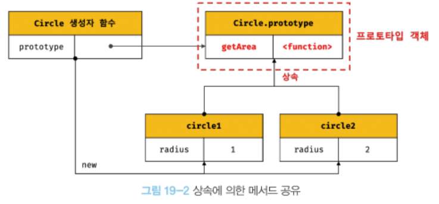
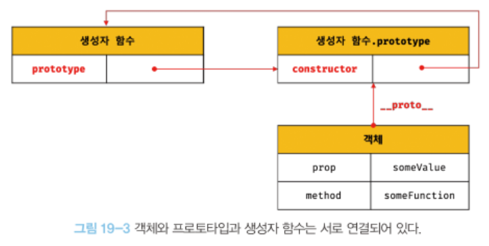
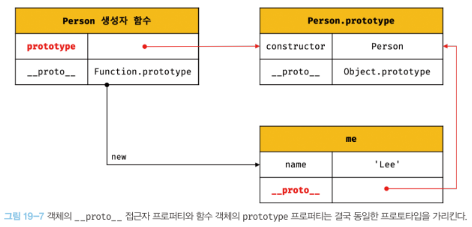
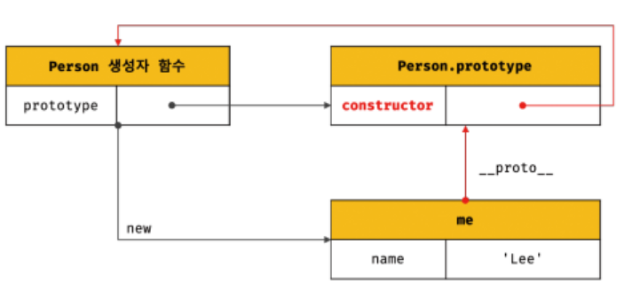
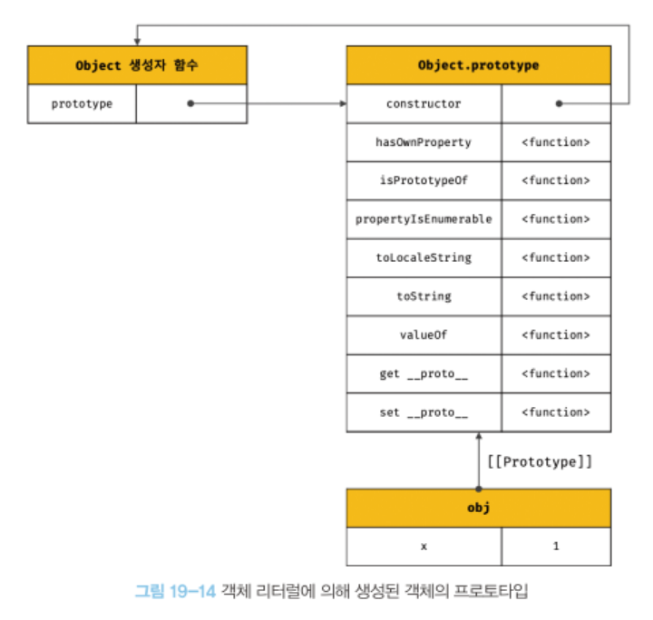
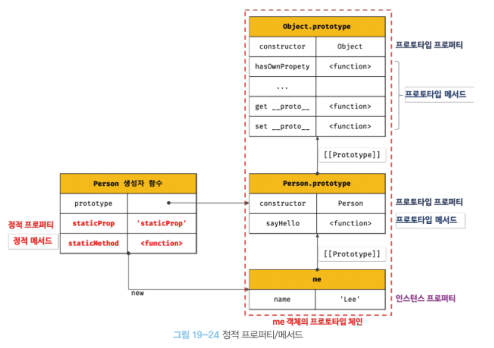

# 19장 프로토타입
❓ 객체 지향 프로그램이 대체 뭔데??
## 19.1 객체지향 프로그래밍
- 객체의 집합으로 프로그램을 표현하려는 프로그래밍 패러다임.
- 객체란? 객체의 상태를 나타내는 데이터와 상태를 조작할 수 있는 동작을 하나로 묶은 자료 구조.

## 19.2 상속과 프로토타입
- 상속
  - 객체지향 프로그래밍의 핵심 개념!
  - 자신의 상위 객체의 프로퍼티, 메서드를 상속받아 그대로 사용할 수 있는것.
  - 프로토타입을 기반으로 상속이 이루어진다.

```jsx
function Circle(radius){
    this.radius = radius;
    // this.getArea = function(){
    //     return Math.PI * this.radius ** 2;
    // }
}

Circle.prototype.getArea = function(){
  return Math.PI * this.radius ** 2;
}
const circle1 = new Circle(1);
const circle2 = new Circle(2);

console.log(circle1.getArea === circle2.getArea); //true

```


## 19.3 프로토타입 객체
- 프로토타입이란?
  - 어떤 객체의 상위 객체의 역할을 하는 객체.
  - 객체와 프로토타입과 생성자함수는 서로 연결되어있다.

### 19.3.1 `__proto__` 접근자 프로퍼티
- 모든 객체는 `__proto__` 접근자 프로퍼티를 통해 자신의 프로토타입에 간접적으로 접근할 수 있다.
- 이 접근자 프로퍼티를 코드 내에서 직접 사용하는것은 권장하지 않음.

### 19.3.2 함수 객체의 prototype 프로퍼티
- 함수 객체의 prototype 프로퍼티는 생성자 함수가 생성할 인스턴스의 프로토타입을 가리킨다.

```jsx
function Person(name){
    this.name = name;
}
const me = new Person('Lee');

console.log(Person.prototype === me.__proto__); //true
```



### 19.3.3 프로토타입의 constructor 프로퍼티와 생성자 함수
```jsx
function Person(name){
    this.name = name;
}

const me = new Person('Lee');

console.log(me.constructor === Person); //true
```


## 19.4 리터럴 표기법에 의해 생성된 객체의 생성자 함수와 프로토타입
- 생성자 함수 호출 없이 만들어지는 객체 리터럴의 프로토타입은 어떻게 연결이 되는가?
```jsx
// 객체 리터럴
const obj = {};

//함수 리터럴
const add = function(a,b){return a+b};
```
- javascript 내부적으로 추상 연산 `OrdinaryObjectCreate`를 호출
  - `Object.prototype`을 프로토타입으로 갖는 빈 객체를 생성.
- 따라서 리터럴 표기법에 의해 생성된 객체도 가상적인 생성자 함수를 가지게 된다.
- 프로토타입과 생성자 함수는 단독으로 존재할 수 없고 언제나 쌍으로 존재한다!

## 19.5 프로토타입의 생성 시점
- 프로토타입은 생성자 함수가 생성되는 시점에 더불어 생성된다.

## 19.6 객체 생성 방식과 프로토타입의 결정
### 19.6.1 객체 리터럴에 의해 생성된 객체의 프로토타입
```jsx
const obj = {x:1};
```
- 객체 리터럴에 의해 생성되는 객체의 프로토타입은 `Object.prototype`
- 


### 19.6.2 Object 생성자 함수에 의해 생성된 객체의 프로토타입
```jsx
const obj = new Object();
```
- `Object.prototype`

### 19.6.3 생성자 함수에 의해 생성된 객체의 프로토타입
```jsx
function Person(name){
    this.name = name;
}

const me = new Person('seyoung');
```
- `Person.prototype`

## 19.7 프로토타입 체인
- 자바스크립트는 객체의 프로퍼티/메서드에 접근하려고 할 때 해당 프로퍼티가 없으면 `[[Prototype]]` 내부 슬롯의 참조를 따라 자신의 부모 역할을 하는 프로토타입의 프로퍼티를 순차적으로 검색한다.
- 이를 프로토타입 체인이라고 한다.
- 프로토타입 체인의 최상위에 위치하는 객체는 언제나 `Object.prototype`
- 즉 프로토타입 체인은 상속과 프로퍼티 검색을 위한 메커니즘
- 스코프 체인은 식별자 검색을 위한 메커니즘.
- 스코프 체인을 통해 해당 식별자를 찾은 후, 해당 식별자의 프로퍼티/메서들르 찾기 위해 프로토타입을 체인을 검색한다.
 
## 19.8 오버라이딩과 프로퍼티 섀도잉
- 오버라이딩 : 상위 클래스가 가지고 있는 메서드를 하위 클래스가 재정의하여 사용하는 것
- 프로퍼티 섀도잉 : 이러한 상속 관계에 의해 가려지는 현상을 프로퍼티 섀도잉이라고 함.
```jsx
const Person = (function(){
    function Person(name){
        this.name = name;
    }
    
    Person.prototype.sayHello = function(){
        console.log('hello')
    }
    return Person;
}());

const me = new Person('yang');

me.sayHello = function(){
    console.log('hi');
}

me.sayHello(); //hi
```


## 19.10 instanceof 연산자
- 프로토타입 체인상에 존재 유무를 알려줌.
```jsx
function Person(name){
    this.name = name;
}

const me = Person('yang');

console.log(me instanceof Person); //true
console.log(me instanceof Object); //true
```


## 19.12 정적 프로퍼티/메서드
- 생성자 함수 본인이 소유한 프로퍼티/메서드를 정적 프로퍼티/메서드라고 하며
- prototype에 등록된 것이 아니기 때문에 인스터스에서는 접근할 수 없다.
```jsx
function Person(name){
    this.name = name;
}
Person.staticProp = 'static prop';

const me = Person('seyoung');
me.staticProp; //error
```


## 19.13 프로퍼티 존재 확인
### 19.13.1 in 연산자
- 객체 내에 특정 프로퍼티가 존재하는지 여부 확인
```jsx
const person = {
  name:'Lee',
  address:'Seoul'
}

console.log('name' in person); //true
```
### 19.13.2 Object.prototype.hasOwnProperty 메서드
- 특정 프로퍼티 존재 확인 가능
```jsx
console.log(person.hasOwnProperty('name')); //true
```


## 19.14 프로퍼티 열거
### 19.14.1 for...in문
- 객체의 모든 프로퍼티를 열거하려면 for in 문 사용

```jsx
const person = {
  name: 'Lee',
  address:'Seoul'
}

for(let key in person){
    console.log(key, person[key]);
}
// name, Lee
// address, Seoul
```