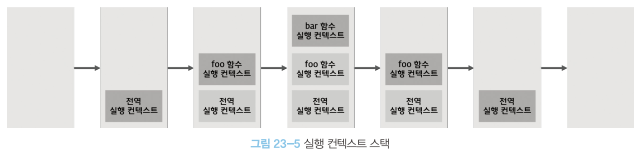

# 23장 실행 컨텍스트
## 23.1 소스코드의 타입
1. 전역 코드 -> 전역 실행 컨텍스트
2. 함수 코드 -> 함수 실행 컨텍스트
3. eval 코드 -> eval 실행 컨텍스트
4. 모듈 코드 -> 모듈 실행 컨텍스트

## 23.2 소스코드의 평가와 실행
- 자바스크립트는 소스코드의 평가와 실행으로 이루어지는데
- 소스코드의 평가가 이루어진다. : 소스코드의 타입을 평가하여 선언문들을 각각의 실행 컨텍스트에 추가.
- 소스코드의 실행(런타임) : 선언문을 제외한 소스 순차적으로 실행.

## 23.3 실행 컨텍스트의 역할
1. 전역 코드 평가
- 전역 스코프에 있는 선언문들을 평가하여 전역 스코프에 등록.

2. 전역 코드 실행
- 런타임이 실행. 이때 변수의 할당, 함수 호출이 일어남.

3. 함수 코드 평가
- 함수 호출로 인해 함수 내부로 진입하면 함수 코드 평가가 이루어짐.
- 이때 함수 내부에 있는 변수들이 지역 스코프에 등록.

4. 함수 코드 실행
- 런타임이 다시 시작되어 함수 코드가 순차적으로 실행.
- 이때 필요한 값들을 스코프 체인, 프로토타입 체인을 통해 검색한다.
  <br><br>

- 실행 컨텍스트는 스코프와 코드 실행 순서를 관리.
- 스코프는 실행 컨텍스트의 렉시컬 환경으로 관리하고
- 코드 실행 순서는 실행 컨텍스트 스택으로 관리.

## 23.4 실행 컨텍스트 스택
```jsx
const x = 1;
function foo(){
    const y = 2;
    
    function bar(){
        const z = 3;
        console.log(x+y+z);
    }
    bar();
}

foo();
```



- 코드 실행 순서는 실행 컨텍스트 스택에 스택 자료구조로 관리된다.


## 23.5 렉시컬 환경
- 렉시컬 환경 : 스코프를 생성하여 식별자에 바인딩된 값을 관리.
- 렉시컬 환경은 두 개의 컴포넌트로 구성된다.
- 환경 레코드 : 스코프에 포함된 식별자를 등록하고, 등록된 식별자에 바인딩된 값을 관리하는 저장소.
- 외부 렉시컬 환경에 대한 참조 : 상위 스코프를 말한다. 상위 코드의 렉시컬 환경.

## 23.6 실행 컨텍스트의 생성과 식별자 검색 과정

### 23.6.1 전역 객체 생성
- 전역 코드 평가되기 이전에 생성된다.
- 빌트인 전역 프로퍼티, 전역함수, 객체 추가
- Web API(DOM, BOM, fetch,,,)

### 23.6.2 전역 코드 평가
1. 전역 실행 컨텍스트 생성
- 전역 실행 컨텍스트를 실행 컨텍스트 스택에 푸쉬

2. 전역 렉시컬 환경 생성
- 전역 렉시컬 환경 생성 후 전역 실행 컨텍스트에 바인딩.

2.1 전역 환경 레코드 생성
- 전역 변수를 관리하는 전역 스코프, 빌트인 전역 프로퍼티, 메소드, 표준 빌트인 객체를 제공.
- 전역 환경 레코드는 객체 환경 레코드, 선언적 환경 레코드로 구성되어 있으며
- 객체 환경레코드는 var 키워드로 정의한 전역 변수, 함수 선언문, 빌트인들을 관리. 이때 BindingObject를 통해 전역 객체에 등록한다.
- 선언적 환경 레코드는 let, const로 선언한 전역 변수를 관리. 선언적 환경 레코드는 객체 환경레코드와는 따로 관리되기때문에 let, const로 선언한 변수들은 TDZ에 빠지게 된다.
- 외부 렉시컬 환경에 대한 참조 결정에 실행중인 실행 컨텍스트의 상위 스코프를 저장한다.

### 23.6.3 전역 코드 실행
- 전역 코드가 실행될 때 실행 중인 실행 컨텍스트에서 식별자를 검색하기 시작한다.

### 23.6.4 foo 함수 코드 평가
- foo 함수가 호출되면 전역 코드의 실행을 중지
- foo 함수 실행 컨텍스트 생성
- 실행 컨텍스트 내에 함수 렉시컬 환경 생성
  - 함수 환경 레코드 생성 : 매개변수, arguments, 함수 몸체에서 선언된 식별자들을 관리.
  - this 바인딩 : [[thisValue]] 내부 슬롯에 this가 바인딩되는데 foo 함수는 일반 함수이기때문에 전역 객체를 가리킨다.
  - 외부 렉시컬 환경에 대한 참조 결정 : 전역 코드에 정의된 전역 함수기 때문에 null 값이 할당된다.
<br><br>
- 함수는 어디서 호출했는지가 아니라 어디에서 정의했는지에 따라 상위 스코프를 결정한다고 했다.
- 이것은 실행 컨텍스트 내의 렉시컬 환경 - 외부 렉시컬 환경 참조에서 상위 스코프가 정해지기 때문에 이렇게 동작하는 것이었다.

### 23.6.5 foo 함수 코드 실행
- 런타임이 시작되어 foo 함수의 소스코드를 실행한다.
- 매개변수에 인수가 할당되고 변수에도 값이 할당된다.
- 이때 식별자 결정을 위해 실행 중인 컨텍스트의 렉시컬 환경에서 식별자를 검색한다.
- 즉 스코프 체인은 실행 컨텍스트의 렉시컬 환경에서 시작하여 외부 렉시컬 환경을 참조로 이어지는 렉시컬 환경의 연속이다.

### 23.6.6 bar 함수 코드 평가
### 23.6.7 bar 함수 코드 실행
### 23.6.8 bar 함수 코드 실행 종료
- 소드코드의 실행이 끝나면 var 함수 실행 컨텍스트는 pop 되어 제거되고 아래에 있는 foo 함수 실행컨텍스트로 이동한다.

### 23.6.9 foo 함수 코드 실행 종료
### 23.6.10 전역 코드 실행 종료
- 더이상 실행한 전역 코드가 없으므로 전역 실행 컨텍스트도 pop되어 제거되고 실행 컨텍스트 스택에는 아무것도 남지 않게 된다.

## 23.7 실행 컨텍스트와 블록 레벨 스코프

