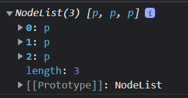

# 27장 배열
## 27.1 배열이란?
- 여러 개의 값을 순차적으로 나열한 자료구조
```jsx
const arr = ['apple', 'banana', 'orange'];
arr[0]; //apple
arr.length; //3
```

- 배열은 object지만 일반 객체와는 구별되는 독특한 특징이 있다.

|구분|객체| 배열  |
|---|---|-----|
|구조|프로퍼티 키, 값|인덱스, 요소|
|값의 참조|프로퍼티 키|인덱스|
|값의 순서|X|O|
|length 프로퍼티|X|O|

## 27.2 자바스크립트 배열은 배열이 아니다

## 27.3 length 프로퍼티와 희소 배열
- 현재 length 프로퍼티 값보다 작은 값을 할당하면 배열의 길이가 줄어든다.
```jsx
const arr = [1,2,3,4,5];

arr.length = 3;
console.log(arr); //[1,2,3]
```

- 현재 length 보다 큰 값을 할당하면 length 프로퍼티 값은 변경되는데 배열의 실제 길이가 늘어나진 않는다.
```jsx
const arr = [1,2,3];
arr.length = 5;
console.log(arr.length);//5
console.log(arr);//(5) [1, 2, 3, empty × 2]
```
- 이렇게 배열의 요소가 연속적으로 위치하지 않고 일부가 비어 있는 배열을 `희소배열`이라고 함.
- 자바스크립트에서 문법적으로 허용하나 사용하지 않는 것을 추천.

## 27.4 배열 생성
### 27.4.1 배열 리터럴
```jsx
const arr = [1,2,3,4,5];
```

### 27.4.2 Array 생성자 함수
```jsx
const arr = new Array(1,2,3,4,5);

const arr = new Array(10);
console.log(arr.length);//10
console.log(arr);//(10) [empty × 10]
```
### 27.4.3 Array.of
- ES6에서 도입된 메서드
```jsx
Array.of(1); //[1]
Array.of(1,2,3); //[1,2,3]
```

### 27.4.4 Array.from
- ES6
- 유사 배열 객체, 이터러블 객체를 인수로 전달 받아 배열로 변환
#### 유사 배열 객체란? : 배열처럼 보이는데 프로퍼티 키를 index로 가지고, length 값을 가지는 객체
```html
<p>하나</p>
<p>둘</p>
<p>셋</p>
```
```jsx
const arr = document.querySelectorAll('p');

arr.forEach(item => item.style.color="red");

const highlight = arr.filter((item) => item.style.color="red");
//Uncaught TypeError: array.filter is not a function

// 유사배열객체에 배열의 메서드를 사용하고 싶을 때 Array.from을 통해 배열로 변환시켜줄 수 있다.
const highlight = Array.from(arr).filter((item) => item.style.color="red");
console.log(highlight); //(3) [p,p,p]

```


#### 이터러블 객체란? : for of 문으로 순회할 수 있고, 스프레드 문법, 배열 비구조화 할당의 대상이 되는 객체
- Array, String, Map, Set, DOM컬렉션(NodeList, HTMLCollection),arguments
```jsx
Array.from('Hello'); //(5) ['H', 'e', 'l', 'l', 'o']
```

- 두번째 인수에 콜백함수를 넣어서 배열을 만들수도 있따.
```jsx
Array.from({length:10}, (_,i) => i);
//(10) [0, 1, 2, 3, 4, 5, 6, 7, 8, 9]

Array.from({length:10}, () => false);
//(10) [false, false, false, false, false, false, false, false, false, false]
```

## 27.5 배열 요소의 참조
```jsx
const arr = [1,2];
console.log(arr[0]); //1
```

## 27.6 배열 요소의 추가와 갱신
```jsx
const arr = [0];
// 요소 추가
arr[1] = 1;
console.log(arr); //[0,1]

//요소 갱신
arr[0] = 1;
console.log(arr);//[1,1]
```

## 27.7 배열 요소의 삭제
- delete 연산자는 희소 배열을 생성하기 때문에 splice 메서드를 사용한다.
```jsx
const arr = [1,2,3];

arr.splice(1,1);
console.log(arr);//[1,3]
```

## 27.8 배열 메서드

## 27.9 배열 고차 함수
- 고차 함수: 함수를 인수로 전달받는 함수

### 27.9.1 Array.prototype.sort
- 순수함수 X
- 문자열 요소 오름차순/내림차순 정렬
```jsx
const fruits = ['Banana', 'Orange', 'Apple'];

// 오름차순 정렬
fruits.sort();
console.log(fruits); //(3) ['Apple', 'Banana', 'Orange']

// 내림차순 정렬
fruits.reverse();
console.log(fruits); //(3) ['Orange', 'Banana', 'Apple']
```

- 기본 정렬 순서가 유니코드 코드 포인트
  - 배열의 요소가 숫자 타입이라도 문자열 타입으로 변경하고 유니코드 코드 포인트에 따라 정렬을 한다.
```jsx
['2','1'].sort(); // ['1','2']
[2,1].sort(); // [1,2]
[2,10].sort(); // [10,2]
```

- 숫자 요소를 정렬할 때는 sort 메서드에 비교 함수를 인수로 전달한다.
  - `< 0` : 첫번째 인수 우선 정렬
  - `= 0` : 그대로
  - `> 0` : 두번째 인수를 앞으로 정렬
```jsx
let points = [40,100,1,5,2,25,10];

// 오름차순
points.sort((a,b) => a-b); //(7) [1, 2, 5, 10, 25, 40, 100]

// 배열에서 최소, 최대값 취득
console.log(points[0], points[points.length-1]); //1, 100

// 내림차순
points.sort((a,b) => b-a);//(7) [100, 40, 25, 10, 5, 2, 1]
```


### 27.9.2 Array.prototype.forEach
### 27.9.3 Array.prototype.map
### 27.9.4 Array.prototype.filter
### 27.9.5 Array.prototype.reduce
### 27.9.6 Array.prototype.some
### 27.9.7 Array.prototype.every
### 27.9.8 Array.prototype.find
### 27.9.9 Array.prototype.findIndex
### 27.9.10 Array.prototype.flatMap


