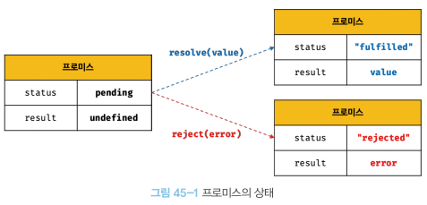

# 45장 프로미스
## 45.1 비동기 처리를 위한 콜백 패턴의 단점
### 45.1.1 콜백 헬
```jsx
const get = (url) => {
    const xhr = new XMLHttpRequest();
    xhr.open('GET', url);
    xhr.send();
    
    // 비동기로 동작
    xhr.onload = () => {
        if(xhr.status === 200){
            return JSON.parse(xhr.response);
        } else{
            console.error('error')
        }
    }
}

const response = get('https://jsonplaceholder.typicode.com/posts/1');
console.log(response); //undefined

```

- 비동기 함수 : 함수 내부에 비동기 코드를 포함한 함수
  - 비동기 함수는 호출되고 내부의 비동기 코드가 완료되지 않아도 종료된다.
  - 비동기 코드는 비동기 함수가 종료된 이후에 완료된다.
  - 따라서 비동기 코드로 값을 반환하거나 변수에 할당하면 기대한 대로 동작하지 않는다.
- 즉 비동기 함수는 비동기 처리 결과를 외부에 반환할 수 없고 상위 스코프 변수에 할당할 수도 없다.
  - 따라서 비동기 함수의 처리 결과는 함수 내부에서 수행되어야 한다.
  - 이때 함수 내부에 콜백 함수를 전달하는 방법이 있다.
```jsx
const successCallback = (res) => {
  console.log(res);
}
const failureCallback = (err) => {
  console.log(err);
}

const get = (url, successCallback, failureCallback) => {
  const xhr = new XMLHttpRequest();
  xhr.open('GET', url);
  xhr.send();

  xhr.onload = () => {
    if(xhr.status ===200){
      successCallback(JSON.parse(xhr.response))
    } else {
      failureCallback(xhr.status);
    }
  }
}
get('https://jsonplaceholder.typicode.com/posts/1', successCallback, failureCallback);

```
- 그런데 만약 GET요청으로 취득한 데이터를 이용해 또 다른 요청을 해야하면 콜백 헬이 발생하게 된다.
```jsx
get('/step1', a=> {
  get(`/step2/${a}`, b=> {
    get(`/step3/${b}`, c=> {
        console.log(c)
    })
  })
})
```

### 45.1.2 에러 처리의 한계

```jsx
try{
    setTimeout(() => { throw new Error('Error')}, 1000);
} catch(e){
    console.error('캐치한 에러', e)
}
```

- 비동기 처리에서 콜백 패턴은 에러 처리가 곤란하다.
- try에서 에러가 발생하면 catch 코드 블록에서 에러가 잡히지 않는다.
  - setTimeout의 콜백함수가 실행될때 setTimeout은 이미 콜스택에서 제거된 상태.
  - 에러는 호출자 방향으로 전파되는데 호출자가 이미 사라진 상황이므로 catch 블록으로 잡히지 않는다.
- 결국 비동기 처리를 위해 콜백패턴을 사용하면 콜백 헬이나, 에러 처리가 곤란하다는 문제가 있다.

## 45.2 프로미스의 생성
```jsx
const promiseGet = (url) => {
    return new Promise((resolve, reject) => {
        const xhr = new XMLHttpRequest();
        xhr.open("GET", url);
        xhr.send();

        xhr.onload = () => {
            if(xhr.status ===200){
                resolve(JSON.parse(xhr.response))
            } else {
                reject(new Error(xhr.status))
            }
        }
    })
}
promiseGet("https://jsonplaceholder.typicode.com/posts/1");
```


- Promise 객체 자체에서 비동기 처리의 상태와 값을 관리해준다.
- pending : 비동기 처리 수행되지 않은 상태
- fulfilled : 비동기 처리 성공
- rejected : 비동기 처리 실패
```jsx
const fulfilled = new Promise(resolve => resolve(1));
console.log(fulfilled);
const rejected = new Promise((_, reject) => reject(new Error('error occurred')));
console.log(rejected);
```

## 45.3 프로미스의 후속 처리 메서드
- fulfilled, rejected 프로미스의 상태에 대한 처리를 하기 위해 then, catch, finally 를 제공
### 45.3.1 Promise.prototype.then
- 첫번째 콜백함수 : fulfilled 상태가 되었을 때 호출
- 두번째 콜백함수 : rejected 상태가 되었을 때 호출
```jsx
new Promise(resolve => resolve('fulfilled'))
    .then(v => console.log(v), e=> console.error(e));
```

### 45.3.2 Promise.prototype.catch
- 프로미스가 rejected 상태일 경우 호출
```jsx
new Promise((_, reject) => reject(new Error('rejected')))
    .catch(e=> console.log(e));
```

### 45.3.3 Promise.prototype.finally
- 프로미스 성공 실패와 상관없이 무조건 한번 호출
- 상태와 상관없이 공통적으로 처리해야하는 하는 내용이 있을 때 유용

```jsx
const promiseGet = (url) => {
    return new Promise((resolve, reject) => {
        const xhr = new XMLHttpRequest();
        xhr.open("GET", url);
        xhr.send();
        
        xhr.onload = () => {
            if(xhr.status === 200){
                resolve(JSON.parse(xhr.response));
            } else{
                reject(new Error(xhr.status));
            }
        }
    })
}

promiseGet('https://jsonplaceholder.typicode.com/posts/1')
    .then(res => console.log(res))
    .catch(err => console.error(err))
    .finally(() => console.log('bye'));
```

## 45.4 프로미스의 에러 처리
- catch 메서드로 처리

## 45.5 프로미스 체이닝
- 콜백 헬이 발생하는 예제를 프로미스로 구현
```jsx
const url = 'https://jsonplaceholder.typicode.com';
const promiseGet = (url) => {
    return new Promise((resolve, reject) => {
        const xhr = new XMLHttpRequest();
        xhr.open("GET", url);
        xhr.send();
        
        xhr.onload = () => {
            if(xhr.status === 200){
                resolve(JSON.parse(xhr.response));
            } else{
                reject(new Error(xhr.status));
            }
        }
    })
}
// id가 1인 postId를 취득
promiseGet(`${url}/posts/1`)
    .then(({userId}) => promiseGet(`${url}/users/${userId}`))
    .then(userInfo => console.log(userInfo))
    .catch(err => console.error(err))
```
- 후속 처리 메서드는 언제나 프로미스를 반환하기 때문에 연속적으로 호출할 수 있다. 이를 프로미스 체이닝이라한다.
- 프로미스 체이닝을 통해 비동기 처리 결과를 전달받아 후속처리를 하므로 콜백헬이 발생하지 않는다.
  - 하지만 콜백 패턴을 사용하긴 하는데 이는 가독성이 좋지않다
  - 그래서 async/await로 해결
```jsx
const url = 'https://jsonplaceholder.typicode.com';
const promiseGet = (url) => {
  return new Promise((resolve, reject) => {
    const xhr = new XMLHttpRequest();
    xhr.open("GET", url);
    xhr.send();

    xhr.onload = () => {
      if(xhr.status === 200){
        resolve(JSON.parse(xhr.response));
      } else{
        reject(new Error(xhr.status));
      }
    }
  })
}

(async () => {
    const {userId} = await promiseGet(`${url}/post/1`);
    const userInfo = await promiseGet(`${url}/users/${userId}`);
    console.log(userInfo);
})
```

## 45.6 프로미스의 정적 메서드
### 45.6.1 Promise.resolve / Promise.reject
- 이미 존재하는 값을 래핑하여 프로미스를 생성
### 45.6.2 Promise.all
- 여러개의 비동기 처리를 모두 병렬로 처리할 때 사용
### 45.6.3 Promise.race
- 가장 먼저 fulfilled가 되는 프로미스를 반환
### 45.6.4 Promise.allSettled
- 비동기 처리가 수행된 상태에서 처리 결과를 배열로 모두 반환

## 45.7 마이크로태스크 큐
- 프로미스의 후속처리 메서드의 콜백함수는 테스크 큐가 아니라 마이크로태스크 큐에 저장된다.
- 마이크로태스크 큐는 태스크큐보다 우선순위가 높다.
```jsx
setTimeout(() => console.log(1),0);

Promise.resolve()
    .then(() => console.log(2))
    .then(() => console.log(3))
// 2->3->1
```

## 45.8 fetch
- XMLHttpRequest 객체와 마찬가지로 HTTP 요청 전송 기능을 제공하는 Web API
- XMLHttpRequest보다 사용법이 간단하고 프로미스를 지원
```jsx
const promise = fetch(url, [, options])
```
- fetch 함수는 HTTP 응답을 나타내는 Response 객체를 래핑한 Promise 객체를 반환.
```jsx
fetch('https://jsonplaceholder.typicode.com/todos/1')
    .then((response) => console.log(response))
    .then((json) => console.log(json))
```
- Response.json 메서드
  - Response 객체에서 HTTP 응답몸체(response.body) 를 취득하영 역직렬화
```jsx
fetch('https://jsonplaceholder.typicode.com/todos/1')
        .then((response) => response.json()) //Promise 객체로 변환
        .then((data) => console.log(data))
```

- fetch 함수는 에러 처리에 주의해야 한다.
  - 네트워크 장애, CORS 에러에 의한 요청 장애만 프로미스 reject 처리를 한다.
  - 나머지 에러는 ok 상태의 boolean 값으로 에러를 반환
  - 그래서 fetch 함수가 reject로 잡지못하는 에러를 따로 처리해줘야함.
```jsx
fetch('https://jsonplaceholder.typicode.com/todos/1')
        .then((response) => {
            if(!response.ok) throw new Error(response.statusText);
            else response.json();
        }) 
        .then((data) => console.log(data))
        .catch(err => console.log(err))
```
- axios 는 모든 에러를 reject로 반환하기 때문에 catch 하나로 에러 처리가 가능함.
  - 또한 fetch보다 다양한 기능을 지원

```jsx
const request = {
    get(url) {
        return fetch(url);
    },
  post(url, payload){
        return fetch(url, {
            method: "POST",
            headers:{'content-Type' : 'application/json'},
            body:JSON.stringify(payload)
        })
  },
}
```